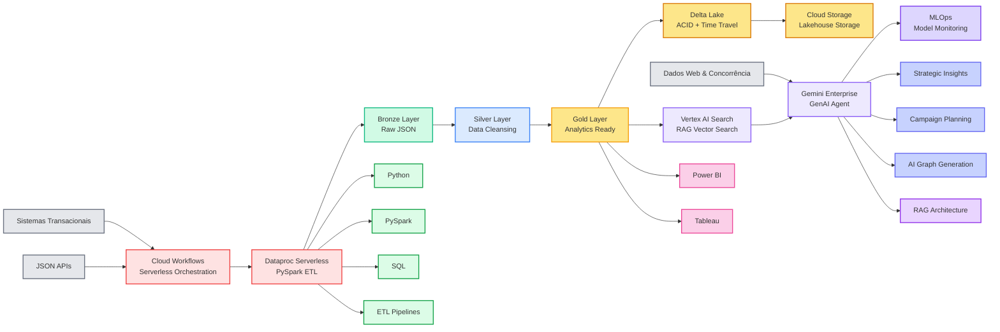

# 🛰️ Bayer GTM Intelligence AI  
## Data Lakehouse to AI Strategic Agent Platform

## 📖 Visão Geral
Este projeto demonstra a criação de um ecossistema completo de dados e IA para o setor de Go-To-Market (GTM) da Bayer. Através da arquitetura **Medallion**, transformamos dados transacionais brutos em uma base de conhecimento (RAG) para um assistente de IA generativa (Gemini).

---

## 🏗️ Arquitetura do Sistema
## A solução foi desenhada para ser escalável e 100% serverless, minimizando custos operacionais.  

## ⚙️ Orquestração & FinOps
Google Cloud Workflows: O Airflow "custo zero" do GCP. A opção de orquestração pelo GCP Composer tem custo.
O Cloud Workflows é perfeito para esse cenário. Ele orquestra serviços da GCP (Dataproc, Cloud Functions, BigQuery) usando uma estrutura em YAML ou JSON. 

Em vez de utilizar clusters fixos (Airflow), optei pelo **Cloud Workflows**, reduzindo o custo fixo para **zero** durante a ociosidade.

---

O intuito é mostrar não ficamos apenas no "fazer o código", mas também pensamos no financeiro (FinOps) e na eficiência da nuvem.  

Para a orquestração, escolhi o Cloud Workflows em vez do Composer. Como a solução é voltada para um modelo SaaS escalável, utilizei uma arquitetura Event-Driven e Serverless.  

Isso reduz o TCO (custo total) para o cliente, já que pagamos apenas pelas execuções, mantendo a visibilidade total do fluxo de dados através do grafo de estados.

main:
  params: [event]
  steps:
    - init_variables:
        assign:
          - project_id: ${sys.get_env("GOOGLE_CLOUD_PROJECT_ID")}
          - region: "us-central1" # ajuste para sua região
          - cluster_name: "bayer-gtm-cluster"
          - lakehouse_status: "STARTING"

    - process_bronze_layer:
        try:
          call: googleapis.dataproc.v1.projects.regions.jobs.submit
          args:
            projectId: ${project_id}
            region: ${region}
            body:
              job:
                pysparkJob:
                  mainPythonFileUri: "gs://bayer-artifacts/scripts/ingest_bronze.py"
                placement:
                  clusterName: ${cluster_name}
          result: bronze_result
        retry: ${http.default_retry}

    - transform_silver_to_gold:
        call: googleapis.dataproc.v1.projects.regions.jobs.submit
        args:
          projectId: ${project_id}
          region: ${region}
          body:
            job:
              pysparkJob:
                mainPythonFileUri: "gs://bayer-artifacts/scripts/refine_gold.py"
              placement:
                clusterName: ${cluster_name}
        result: gold_result

    - refresh_vertex_ai_index:
        call: http.post
        args:
          url: ${"https://discoveryengine.googleapis.com/v1/projects/" + project_id + "/locations/global/collections/default_collection/dataStores/bayer-gtm-gold-ds/branches/0/documents:import"}
          auth:
            type: OAuth2
        result: index_status

    - final_check_and_notify:
        switch:
          - condition: ${index_status.code == 200}
            next: success_notification
        next: handle_failure

    - success_notification:
        return: "Pipeline Bayer GTM finalizado: Dados na Gold e Gemini atualizado."

    - handle_failure:
        raise: "Erro crítico no pipeline de dados GTM."
        

### Fluxo de Dados:
1. **Ingestão (Bronze):** Captura de 500k registros JSON via Spark.
2. **Refino (Silver):** Tratamento de esquemas e limpeza.
3. **Consumo (Gold):** Tabelas agregadas por `regiao`, `fornecedor` e `categoria`.
4. **Busca Vetorial:** Indexação no Vertex AI Search.
5. **LLM Interface:** Gemini Enterprise respondendo com Grounding na Gold.

---

### Amostra do início do data lakehouse em Delta e scripts do pipeline de ingestão e tratamento (ETL) da arquitetura medalhão:

---

### Evidências do lakehouse em Delta com parquet:

---

# 🤖 Demonstração da IA (Insights Estratégicos)

---

## Campos disponíveis para análise estratégica  
O agente é capaz de informar sobre os campos sem precisar de conhecimentos técnicos de SQL por exemplo

---

## Começando a explorar os dados para validar a consistência

### Faturamento: 

---

## Verificando se a capacidade de drill down atende  
### Iniciando análise estratégica com sugestão de diretrizes obedecendo as regras de negócios:

---

## Performance com faturamento
O assistente é capaz de fazer análises de performance comparando os campos

---

### Top 3 com análise estratégica

---

## Planejamento de campanhas baseado em regras de negócios e dados da web  
Note que "safra integrada" citada pelo agente não está nos dados do Lakehouse.  
Esta feature de consulta na web pode ser ativada ou desativada conforme políticas da empresa.  
  

---

### Medindo sucesso da campanha comparando dados do lakehouse com dados da web:

---

## Exemplos de geração de gráficos conforme o prompt que você digitar:

---

## Procurando oportunidades de negócio

---

## Aprofundando o planejamento de campanhas

---

## Otimização da movimentação de acesso com proposta de redistribuição estratégica

---

## 🛠️ Como Executar
1. Clone o repositório.
2. Configure o Bucket no GCS conforme a estrutura Medallion.
3. Deploy do script Spark no Dataproc.
4. Importação do `workflow.yaml` no Cloud Workflows.

---
**Eduardo Menezes** *Senior Data Engineer | especialista em Dados: Engenharia de dados, BI, AI & Cloud*
